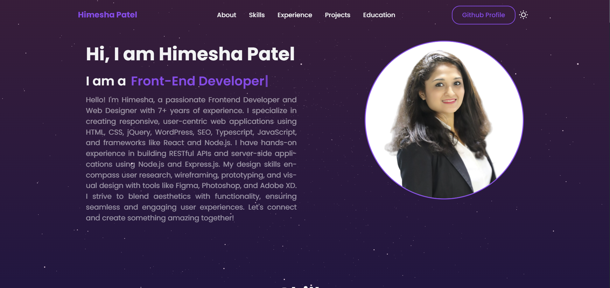

# Portfolio | Himesha Patel

A personal portfolio website built with React to showcase my projects and skills.

## 🚀 Live Demo

[View Portfolio] https://www.himeshapatel.com/

## ⚙️ Tech Stack

- React.js
- Vite
- HTML5
- CSS3
- JavaScript
- [Add any other technologies you've used]

## 🎯 Features

- Responsive Design
- Modern UI/UX
- Interactive Components
- Project Showcase-
- [Add other key features]

## 📸 Screenshots



## 🛠️ Installation Steps

1. Clone the repository
```bash
git clone https://github.com/HimeshaPatel/new-portfolio.git
```

2. Change the working directory
```bash
cd new-portfolio.git
```

3. Install dependencies
```bash
npm install
```

4. Run the app
```bash
npm run dev
```

🌟 You are all set! Open [localhost:5173](http://localhost:5173) to see the app.

## 🏗️ Project Structure

```
portfolio/
├── public/
│   ├── react.svg
│   └── [other public assets]
├── src/
│   ├── components/
│   ├── assets/
│   ├── App.jsx
│   └── main.jsx
├── .storybook/
├── index.html
└── package.json
```

## 🎨 Color Reference

| Color          | Hex                                                                |
| -------------- | ------------------------------------------------------------------ |
| Primary Color  |  #000000 |
| Secondary Color|  #ffffff |
[Add your color palette]

## 💡 Future Updates

- [ ] Add Blog Section
- [ ] Implement Dark Mode
- [ ] Add More Projects
[Add your planned features]

## 👨‍💻 Connect with Me

- [LinkedIn] https://www.linkedin.com/in/himesha-%E2%9A%9B%EF%B8%8F-patel-6652a556/
- [GitHub] (https://github.com/HimeshaPatel)
- [Portfolio] https://www.himeshapatel.com/
- [Email](mailto:patelhimesha7@gmail.com)

## 📄 License

This project is licensed under the MIT License - see the [LICENSE](LICENSE) file for details.

---
<p align="center">Made with ❤️ by Himesha Patel</p>


